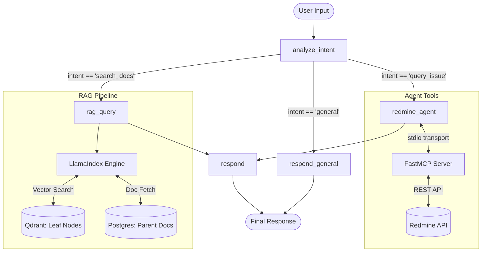

# Redmine + LangGraph RAG Orchestrator

An enterprise-grade agentic assistant and orchestrator built with **LangGraph**, **LlamaIndex**, and the **Model Context Protocol (MCP)** to intelligently interact with and query **Redmine**.

---

## 🎯 Motivation & Purpose

### What is Redmine?
[Redmine](https://www.redmine.org/) is a widely adopted, flexible open-source project management and issue-tracking web application. Engineering, IT, and operations teams rely heavily on Redmine to manage sprints, track bugs, organize feature requests, document requirements, and monitor resolution timelines across multiple projects.

### The Problem It Solves
As organizations scale, their Redmine instances accumulate thousands of issues, nested comments, cross-ticket relationships, and historical resolutions. This creates significant friction:
* **Information Fragmentation:** Critical technical context and resolution steps are buried across years of ticket comments and attachments.
* **Ineffective Native Search:** Keyword-based search often fails when queries use synonyms, natural language questions, or concepts that span multiple tickets.
* **Context Loss & Triage Overhead:** Engineers and project managers spend hours manually locating past bug fixes, checking current issue statuses, and synthesizing fragmented ticket histories.

### The Solution: A Hybrid Agentic & RAG Architecture
This project bridges the gap between **deterministic issue management** and **semantic knowledge discovery** by combining:
1. **Live Tool Execution (MCP):** A ReAct agent connected to Redmine's REST API via a dedicated FastMCP server for live operations (querying statuses, inspecting issue details, and managing tickets).
2. **Semantic Context Retrieval (Advanced RAG):** A LlamaIndex pipeline utilizing a Parent-Child (Auto Merging Retriever) strategy over historical tickets, extracting leaf-level precision while preserving entire ticket contexts.
3. **Intent-Driven Orchestration:** A LangGraph state graph that dynamically classifies user requests, routes to the appropriate tool or retrieval subsystem, and synthesizes clear, structured answers.

## 🚀 Key Technical Features

*   **LangGraph Orchestrator:** Conditional, intent-based routing with immutable state management (`AgentState`).
*   **Advanced RAG Strategy:** Implements an Auto Merging Retriever pattern (Parent-Child chunking) for high-precision semantic search without context loss.
*   **MCP Integration:** Decoupled execution of Redmine tools utilizing a **FastMCP standard I/O server**, isolating API and authentication logic from the core agent workflow.
*   **Asynchronous & Thread-Safe:** Isolates synchronous LlamaIndex operations within LangGraph's async topology using worker threads (`asyncio.to_thread`).
*   **Strict Configuration:** Boot-time environment validation via Pydantic Settings.

## 🏗️ Architecture

The orchestrator follows a conditional routing pattern based on user intent classification.



### Agent State (`AgentState`)
The agent maintains its context immutably through LangGraph's checkpointer:
*   `messages`: Tracks the conversation history.
*   `intent`: Extracted user intent (forced via `with_structured_output`).
*   `rag_context` / `redmine_result`: Isolated storage ensuring the final response node (`respond`) has the exact context generated by the sub-graphs.

## 🧠 Retrieval & Chunking Strategy

Naive chunking often leads to a tradeoff between precision (small chunks) and context (large chunks). To solve this, the project implements a **Parent-Child Retrieval Strategy** using `HierarchicalNodeParser` and an `AutoMergingRetriever`.

**How it works:**
1.  **Hierarchical Chunking**: Documents are split into a hierarchical tree (e.g., full ticket -> comments -> sentences). 
2.  **Storage Split**: 
    *   **Qdrant (Vector Store)**: Indexes *only* the smallest "leaf" nodes. This guarantees high precision for semantic vector searches.
    *   **PostgreSQL (Document Store)**: Stores the entire structural tree of the documents.
3.  **Retrieval Execution**: When a user's query hits a specific semantic match (a leaf node), the `AutoMergingRetriever` automatically pulls up the tree to fetch the broader **parent document** (the entire ticket).

**Justification:** This architecture ensures that the LLM receives the highly specific answer it searched for *along with* the surrounding contextual structure, eliminating the fragmented responses typical of standard RAG pipelines.

## 🛠️ Technology Stack

*   **AI/Agent Frameworks:** LangGraph, LlamaIndex, LangChain
*   **Language:** Python 3.12+
*   **Vector Database:** Qdrant
*   **Relational Database:** PostgreSQL (Document Store & LangGraph checkpointer)
*   **Tool Integration:** Model Context Protocol (MCP) via FastMCP
*   **Containerization:** Docker & Docker Compose
*   **Testing & Evaluation:** Pytest, Ragas

## 🧪 Testing and Evaluation

The project enforces reliability through multiple testing layers:

*   **Unit Tests (`make test`)**: Standard Pytest suite for testing independent Python functions, configuration validations, and prompt template rendering. Runs with `asyncio_mode=auto`.
*   **Integration Tests**: Validates interactions with the Dockerized infrastructure (Postgres, Qdrant). Marked via `@pytest.mark.integration`.
*   **RAG Evaluation (`make test-ragas`)**: An automated evaluation suite using **Ragas**. It spins up temporary vector collections, assesses the RAG pipeline on metrics like *Faithfulness* and *Answer Relevance*, and cleans up after itself. Results can be visualized via a local HTTP server (`make serve-ragas`).
*   **MCP Smoke Tests (`make mcp-test`)**: Validates the isolated FastMCP server by performing a raw JSON-RPC handshake (`initialize`) over standard I/O streams using Docker.

## ⚙️ Setup and Deployment

### Prerequisites
*   Python >= 3.12
*   Docker & Docker Compose
*   `make`

### Installation
1.  Create and activate a virtual environment (`.venv`).
2.  Install dependencies:
    ```bash
    make install
    ```
    *(Note: The MCP server requires `fastmcp` which must be installed in the virtual environment for the `redmine_agent` to properly spawn the subprocess).*

### Environment Variables
Configure your keys in the `.env` file (see `.env.example`).
*   `GROQ_API_KEY` and `NVIDIA_API_KEY` are required by the graph nodes.
*   `HUGGINGFACE_API_KEY` is needed for the `hf_api` embedding provider.

### Running the Application

*   **Start Docker Infrastructure** (Postgres, Qdrant, Redmine):
    ```bash
    make docker-up
    ```
*   **Start LangGraph Dev Server**:
    ```bash
    make dev
    ```

### Ingestion Pipeline
To index Redmine data into the Qdrant Vector Store:
*   **Full Sync**: `make index`
*   **Incremental Sync** (last 24h): `make index-incremental`

## 📚 Makefile Commands
Use `make help` to see all available lifecycle commands for testing, building, and deployment.
