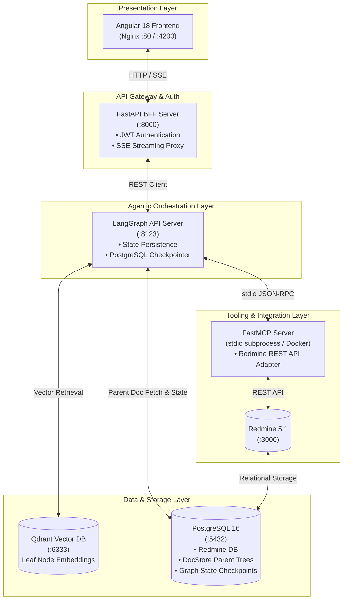
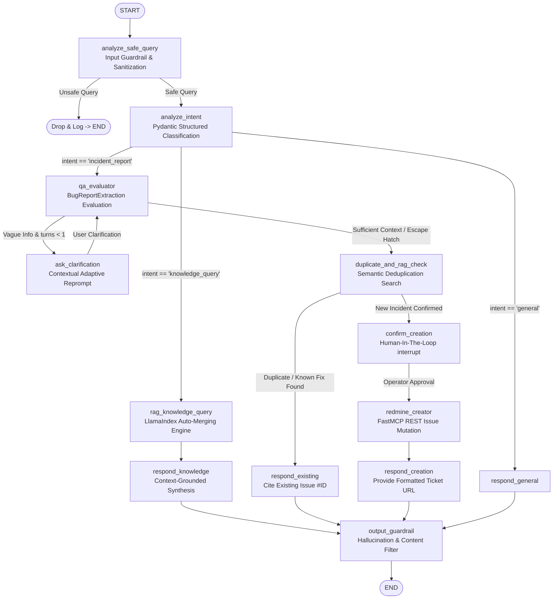

# Redmine + LangGraph RAG Enterprise Orchestrator

[](https://www.python.org/downloads/)
[](https://github.com/langchain-ai/langgraph)
[](https://www.llamaindex.ai/)
[](https://modelcontextprotocol.io/)
[](https://qdrant.tech/)
[](https://angular.dev/)
[](https://fastapi.tiangolo.com/)
[](https://github.com/features/actions)
[](https://opensource.org/licenses/MIT)

An end-to-end, enterprise-grade AI agentic platform and hybrid IT copilot combining **LangGraph** (stateful cyclic orchestration, guardrails, multi-turn clarification, and Human-in-the-Loop), **LlamaIndex** (hierarchical Parent-Child RAG with `AutoMergingRetriever`), and **Model Context Protocol (FastMCP)** for deterministic integration with **Redmine**.

---

## 🎯 Executive Overview & Motivation

### The Problem in Enterprise IT & Engineering
In organizations using issue trackers like [Redmine](https://www.redmine.org/) across multiple cross-functional teams, historical knowledge becomes fragmented over time:
* **Context Fragmentation:** Critical resolutions, root causes, and workarounds remain buried inside hundreds of nested comments and closed tickets.
* **Ineffective Keyword Search:** Legacy search mechanisms fail when queries use natural language, synonyms, or describe symptoms rather than exact error codes.
* **Triage Overhead & Duplicate Tickets:** Support engineers and QA analysts waste hours manually reviewing vague incident reports, asking repetitive clarification questions, and triaging duplicate tickets.

### The Solution: An End-to-End Hybrid Agentic System
This platform delivers a production-ready solution featuring:
1. **Intelligent Incident Triage & Creation:** Evaluates bug report completeness, executes adaptive multi-turn clarification loops with safe escape hatches, performs semantic duplicate detection against historical tickets, and executes **Human-in-the-Loop (HITL)** project assignment before persisting tickets.
2. **Deterministic Tool Execution via MCP:** Isolates mutations and API interactions within a dedicated **FastMCP server (stdio transport)**, enforcing the *Principle of Least Privilege* and Command-Query Separation (CQS).
3. **High-Precision Hierarchical RAG:** Replaces naive chunking with an **Auto-Merging Retriever (Parent-Child)** pattern over Qdrant (leaf vector embeddings) and PostgreSQL (hierarchical document store).
4. **Full-Stack Enterprise Architecture:** Decoupled Angular 18 frontend with reactive Server-Sent Events (SSE) streaming, FastAPI Backend-for-Frontend (BFF) with JWT authentication, and automated multi-stage CI/CD.

---

## 📊 Empirical Evaluation & Hard Evidence

To guarantee enterprise reliability, the system incorporates rigorous automated evaluation pipelines across both semantic retrieval and cognitive agent behavior.

### 1. RAG Retrieval Performance ([Ragas Framework](tests/ragas/))
Audited using the **Ragas** framework over domain-specific Redmine tickets ([`tests/ragas/results/scores_latest.json`](tests/ragas/results/scores_latest.json)):

| Ragas Metric | Score | Target | Description |
| :--- | :---: | :---: | :--- |
| **Faithfulness** | **95.4%** | > 85% | Factual consistency of generated answers with retrieved context (hallucination control). |
| **Context Recall** | **100.0%** | > 90% | Ratio of ground-truth relevant context retrieved by the Auto-Merging Retriever. |
| **Context Precision** | **94.0%** | > 85% | Signal-to-noise ratio in retrieved parent-child chunks. |
| **Answer Relevancy** | **74.5%** | > 70% | Direct semantic alignment of the response with user query intent. |

*Visual dashboard available locally via `make serve-ragas` or inside the Angular UI at `/tests`.*

### 2. Agent Behavioral & Routing Benchmark ([Agent Eval Suite](tests/agent_eval/))
Automated deterministic test harness verifying state transitions, edge conditions, and guardrails ([`tests/agent_eval/evaluation_report.md`](tests/agent_eval/evaluation_report.md)):

| Evaluated Subsystem | Metric | Result | Behavioral Guarantee |
| :--- | :--- | :---: | :--- |
| **Intent & Clarification** | Routing Precision | **100.0%** | Differentiates vague reports from complete bugs; avoids infinite loops via turn counters. |
| **Deduplication Engine** | F1-Score | **100.0%** | Zero false-duplicate merges on same-endpoint different-root-cause tickets. |
| **False Positive Control** | Precision | **100.0%** | Does not suppress valid new bug tickets when partial semantic overlap occurs. |
| **Project Assignment** | Routing Accuracy | **100.0%** | Maps infrastructure incidents to SRE projects and application bugs to App projects. |

---

## 🏗️ System Architecture

### 1. End-to-End Distributed Topology



### 2. LangGraph State Machine & Workflow

The core graph ([`src/agent/graph.py`](src/agent/graph.py)) executes an immutable state machine ([`AgentState`](src/agent/state.py)) with safety guardrails and Human-in-the-Loop intervention:



---

## 🧠 Key Technical Decisions & Innovations

### 1. Hierarchical Chunking: Parent-Child Retrieval
Naive fixed-size chunking forces an engineering compromise: small chunks miss surrounding ticket history, while large chunks dilute embedding representations.
* **Implementation:** Uses `HierarchicalNodeParser` with `AutoMergingRetriever`.
* **Storage Partitioning:**
  * **Qdrant (Vector Store):** Indexes solely the smallest leaf nodes (e.g., individual comments, log snippets) for maximal semantic search precision.
  * **PostgreSQL (Document Store):** Retains the entire parent-child tree.
* **Auto-Merge Behavior:** When multiple leaf hits cross a threshold, the retriever automatically ascends the hierarchy, supplying the LLM with the full base ticket and conversation thread.

### 2. Command-Query Separation (CQS) in Agent Workflows
Documented in [`docs/informe_decision_arquitectura_desacoplamiento_triaje_creacion.md`](docs/informe_decision_arquitectura_desacoplamiento_triaje_creacion.md):
* **Read Phase (Deduplication):** LLM is strictly constrained to read-only tools (`get_issue`, `list_issues`, vector search). No mutation tool is exposed, preventing indirect prompt injection from malicious historical tickets.
* **Write Phase (Creation):** Creation is executed by a separate downstream node (`redmine_creator`) only after explicit schema validation and Human-in-the-Loop confirmation.
* **Resilience:** Network timeouts during Redmine API creation can be retried via LangGraph `RetryPolicy` without re-running vector search or LLM reasoning.

### 3. Human-In-The-Loop (HITL) via Native `interrupt()`
Before mutating production issue trackers, the agent pauses execution state in PostgreSQL using LangGraph's native `interrupt()`. The user/operator confirms or overrides target project identifiers directly in the Angular UI or REST API before resuming.

---

## 🛡️ AI Governance, Telemetry & Continuous Improvement (The Flywheel)

Production-grade AI systems require full auditability, human oversight, and closed-loop feedback systems to evolve safely without regressions.

```mermaid
flowchart LR
    User([End User / Operator]) -->|1. Rating 👍/👎\nCategory & Comments| UI[Angular 18 UI]
    UI -->|2. POST /chat/feedback| BFF[FastAPI BFF Gateway]
    BFF -->|3. create_feedback| LS[(LangSmith Telemetry)]
    LS -->|4. Triage low scores\nuser_score == 0| EvalTeam[QA & AI Engineering]
    EvalTeam -->|5. Curate Edge Cases| Fixtures[tests/agent_eval/fixtures.py]
    Fixtures -->|6. Regression Gate| CI[GitHub Actions CI/CD]
    CI -->|7. Verified Deployment| Prod([Production Graph])
```



* **Interactive Explicit Feedback:** The Angular chat UI exposes rating actions (thumbs up/down) and a diagnostic feedback modal on negative responses, categorizing issues (e.g., *Inaccurate Answer*, *Insufficient Context*, *Wrong Routing*).
* **Direct Tracing Ingestion:** The FastAPI BFF intercepts feedback via `POST /chat/feedback` and registers it directly into **LangSmith** (`langsmith.Client().create_feedback`) associated with the exact `run_id`.
* **State Checkpointing & Compliance Audit:** LangGraph state transitions are persisted in PostgreSQL (`langgraph-checkpoint-postgres`). Every decision, retrieved context, and operator override is fully auditable for compliance (SOC2 / ISO 27001).
* **Test-Driven Prompt & Model Evolution:** Failed interactions in production are systematically converted into deterministic test fixtures inside [`tests/agent_eval/fixtures.py`](tests/agent_eval/fixtures.py). The GitHub Actions CI/CD pipeline enforces 100% accuracy before any prompt or model update is released.

---

## 🛠️ Technology Stack

| Layer | Technologies |
| :--- | :--- |
| **Agent Orchestration** | LangGraph, LangChain, Pydantic v2, Guardrails AI |
| **RAG & Retrieval** | LlamaIndex, `HierarchicalNodeParser`, `AutoMergingRetriever` |
| **Model Integration** | FastMCP (Model Context Protocol), Groq (`gpt-oss-120b`), NVIDIA NIM, Ollama |
| **Vector & Document Databases** | Qdrant (Leaf Vector Embeddings), PostgreSQL 16 (DocStore & LangGraph Checkpointer) |
| **External Systems** | Redmine 5.1 REST API |
| **Backend & API** | FastAPI, Server-Sent Events (SSE), JWT Authentication, HTTPX |
| **Frontend** | Angular 18, SCSS, Nginx Reverse Proxy |
| **DevOps & Testing** | Docker & Docker Compose, GitHub Actions, Pytest, Ragas, Ruff, MyPy |

---

## 🚀 Quickstart & Setup

### Option A: Complete Stack via Docker Compose (Recommended)

1. **Clone the repository:**
   ```bash
   git clone https://github.com/santiFie/Redmine-RAG-Project.git
   cd Redmine-RAG-Project
   ```

2. **Configure environment variables:**
   ```bash
   cp .env.example .env
   # Add your GROQ_API_KEY and NVIDIA_API_KEY in .env
   ```

3. **Build and launch the full platform:**
   ```bash
   docker compose up --build -d
   ```
   *Services will be available at:*
   * **Angular UI:** [http://localhost:4200](http://localhost:4200) (or port 80 in prod)
   * **FastAPI BFF API Docs:** [http://localhost:8000/docs](http://localhost:8000/docs)
   * **LangGraph Dev API:** [http://localhost:8123/docs](http://localhost:8123/docs)
   * **Redmine:** [http://localhost:3000](http://localhost:3000) (admin / admin)
   * **Qdrant Dashboard:** [http://localhost:6333/dashboard](http://localhost:6333/dashboard)

4. **Seed realistic test tickets & run initial indexing:**
   ```bash
   make seed-data
   ```

---

### Option B: Local Python Development

1. **Create and activate a virtual environment:**
   ```bash
   python3.12 -m venv .venv
   source .venv/bin/activate
   ```

2. **Install dependencies and compatibility shims:**
   ```bash
   make install
   ```

3. **Start infrastructure backing services (PostgreSQL, Qdrant, Redmine):**
   ```bash
   make docker-up
   ```

4. **Start LangGraph Dev Server:**
   ```bash
   make dev
   ```

---

## 🧪 Testing & Quality Assurance

Run the comprehensive test suites via `make`:

```bash
# 1. Run standard unit and component tests
make test

# 2. Run deterministic agent evaluation (routing, deduplication, clarification)
make test-agent-eval

# 3. Run RAG evaluation via Ragas and start results dashboard
make test-ragas

# 4. Perform isolated FastMCP handshake smoke test
make mcp-test
```

### CI/CD Pipeline (GitHub Actions)
Configured in [`.github/workflows/ci.yml`](.github/workflows/ci.yml) with 4 automated stages on every push and PR:
1. **Python Lint & Typecheck:** `ruff check`, `ruff format --check`, `mypy src/`
2. **Angular UI Build:** Node.js 24 compilation and asset check
3. **Unit Tests:** Isolated pytest execution with mocked external credentials
4. **Docker Services & Smoke Tests:** Ephemeral multi-service stack spinup, health-readiness polling, live API smoke tests, and FastMCP stdio handshake

---

## 📖 In-Depth Technical Documentation

For detailed architectural analyses and specifications:
* [**Use Case 1: QA Triage & Bug Reporting Copilot**](docs/caso_de_uso_1_triage_qa_automator.md) — Multi-turn flows, escape hatches, and state transitions.
* [**Use Case 2: SRE Post-Mortem & Incident Copilot**](docs/caso_de_uso_2_sre_post_mortem_copilot.md) — Root-cause correlation across historical issues.
* [**Architectural Decision Record (ADR): CQS Decoupling**](docs/informe_decision_arquitectura_desacoplamiento_triaje_creacion.md) — Security analysis of tool decoupling.
* [**AI Governance & Continuous Feedback Loop**](docs/gobernanza_y_mejora_continua_feedback_loop.md) — Telemetry, feedback loops, and test-driven continuous improvement.
* [**DevOps & Testing Guide**](docs/guia_devops_github_actions_testing.md) — CI/CD design, health polling, and container teardown.
* [**Ragas Evaluation Guide**](ragas_evaluation_guide.md) — Metric formulation and synthetic dataset generation.
* [**Portfolio Demo Script**](docs/guion_demo_portfolio.md) — Video walkthrough guide and LinkedIn showcase post.

---

## 📄 License
This project is licensed under the [MIT License](LICENSE).
