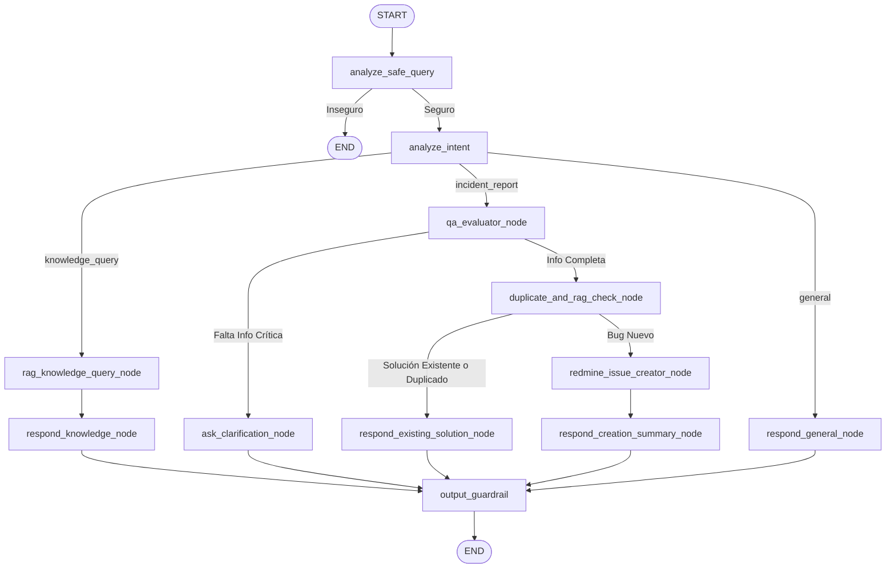

# Arquitectura y Diseño: Copiloto de TI Híbrido (Triaje de QA + RAG de Conocimiento)

## 1. Visión General y Arquitectura Dual

El sistema está diseñado como un **Copiloto Operacional de TI Integral** en **LangGraph**, capaz de resolver dos necesidades fundamentales de una organización sin colisionar entre sí:

1. **RAG Convencional de Base de Conocimiento (`knowledge_query`)**:
   * Permite a los usuarios realizar preguntas operativas, de procesos o configuraciones (*ej. "¿Cómo configurar la VPN para nuevos empleados?"*, *"¿Qué versión de Postgres usamos?"*).
   * Recupera información jerárquica con **LlamaIndex + Qdrant**.
   * **Comportamiento Proactivo ante Vacíos de Información**: Si la base de conocimiento no contiene la respuesta, el sistema no solo informa la ausencia de datos, sino que ofrece proactivamente abrir un ticket de solicitud a IT/Infraestructura.

2. **Triaje y Creación Asistida de Incidentes (`incident_report`)**:
   * Para reportes de fallas o bugs (*ej. "Me da error 500 al subir el reporte"*).
   * Evalúa si el reporte tiene suficiente información de reproducción (*steps to reproduce*, entorno, logs).
   * Si falta información, **repregunta al usuario de forma multi-turno**.
   * Si está completo, consulta la base de conocimiento para detectar si es un error ya resuelto y verifica duplicados en tiempo real mediante **Redmine MCP**.
   * Si es un bug nuevo, crea el ticket formal estructurado en Redmine.

3. **Conversación General (`general`)**:
   * Saludos, cortesía y explicación de capacidades.

---

## 2. Topología del Grafo Unificado (LangGraph)



---

## 3. Especificación del Estado del Agente (`AgentState`)

```python
from typing import Annotated, Any, Literal, NotRequired
from typing_extensions import TypedDict
from langgraph.graph.message import add_messages
from pydantic import BaseModel, Field


class IntentClassification(BaseModel):
    reasoning: str = Field(description="Explicación breve de por qué se eligió la intención.")
    intent: Literal["knowledge_query", "incident_report", "general"]


class BugReportExtraction(BaseModel):
    is_sufficient: bool = Field(
        description="True si el usuario proporcionó suficiente contexto del error para reproducirlo o categorizarlo."
    )
    missing_fields: list[str] = Field(
        default_factory=list,
        description="Lista de datos ausentes necesarios (ej. pasos para reproducir, entorno, versión, mensaje de error exacto)."
    )
    title_summary: str = Field(
        description="Título conciso y profesional para el posible ticket de Redmine."
    )
    reproduction_steps: str = Field(
        default="",
        description="Pasos para reproducir reconstruidos a partir de la conversación."
    )
    environment_info: str = Field(
        default="",
        description="Detalles del entorno (navegador, SO, módulo del sistema)."
    )
    suggested_tracker: Literal["Bug", "Feature", "Soporte"] = Field(
        default="Bug"
    )
    suggested_priority: Literal["Baja", "Normal", "Alta", "Urgente"] = Field(
        default="Normal"
    )


class AgentState(TypedDict):
    # Historial de mensajes y entradas
    messages: Annotated[list[Any], add_messages]
    user_input: str
    is_safe_query: bool
    intent: Literal["knowledge_query", "incident_report", "general"]

    # Rama RAG Convencional
    rag_context: NotRequired[str]
    retrieved_issue_ids: NotRequired[list[int]]

    # Rama QA & Triaje
    bug_analysis: NotRequired[BugReportExtraction | None]
    is_duplicate: NotRequired[bool]
    duplicate_issue_id: NotRequired[int | None]
    created_issue_id: NotRequired[int | None]
    created_issue_url: NotRequired[str | None]

    # Salida Final
    final_answer: str
```

---

## 4. Descripción y Responsabilidades de los Nodos

### 0. `analyze_intent` (Enrutador Semántico)
* **Objetivo**: Clasifica el mensaje del usuario con `with_structured_output(IntentClassification)`.
* **Criterios de Clasificación**:
  * `knowledge_query`: Preguntas de *"¿Cómo se hace X?"*, *"¿Dónde está la doc de Y?"*, consultas sobre tickets o infraestructura existente.
  * `incident_report`: Declaraciones de fallas, errores en pantalla, bugs (*"No me funciona X"*, *"Da error 500"*).
  * `general`: Saludos, agradecimientos o preguntas generales fuera de soporte.

---

### Rama 1: Base de Conocimiento (RAG Convencional)

#### `rag_knowledge_query_node`
* Ejecuta `await get_rag_engine().aquery(user_question)`.
* Almacena en `state["rag_context"]` los fragmentos jerárquicos recuperados y en `state["retrieved_issue_ids"]` los IDs de tickets asociados.

#### `respond_knowledge_node`
* **Si hay contexto relevante**: Sintetiza la respuesta paso a paso citando las referencias (`### 🔗 Tickets de Referencia`).
* **Si NO hay contexto (Zero-Hit / Vacío)**:
  * Genera una respuesta honesta y proactiva:
    > *"No se encontró documentación ni tickets históricos relacionados con '{pregunta}'. ¿Deseas que cree un ticket de consulta en Redmine para que el equipo responsable lo revise?"*

---

### Rama 2: Triaje & Creación de Incidentes

#### `qa_evaluator_node`
* Extrae los datos técnicos mediante `BugReportExtraction`.
* Evalúa si el reporte tiene suficiente detalle para ser investigado.

#### `ask_clarification_node`
* Si `is_sufficient = False`, responde amablemente al usuario solicitando los puntos de `missing_fields`.
* Finaliza el turno para esperar el próximo mensaje del usuario (aprovechando la memoria de LangGraph).

#### `duplicate_and_rag_check_node`
* Construye una **Query Enriquecida** utilizando los datos extraídos (Título, Entorno, Pasos).
* Ejecuta una búsqueda vectorial jerárquica (RAG) en Qdrant para obtener los tickets semánticamente más relevantes (`retrieved_issue_ids`, limitados al top-K).
* Se apoya en un LLM (usando el contexto recuperado) para determinar simultáneamente:
  1. **RAG Histórico**: ¿Este bug ya tiene solución documentada en tickets cerrados recuperados?
  2. **Deduplicación Activa**: ¿Existe algún ticket abierto entre los recuperados con el mismo problema?
* Si hay duplicado o solución conocida $\to$ dirige a `respond_existing_solution_node`.
* Si es un problema nuevo $\to$ dirige a `redmine_issue_creator_node`.

#### `redmine_issue_creator_node`
* Invoca la herramienta MCP `create_issue` con el título, descripción estructurada, prioridad y tracker sugeridos.

#### `respond_creation_summary_node`
* Confirma al usuario la creación exitosa con el enlace directo al ticket y el resumen del diagnóstico inicial.

---

## 5. Esqueleto de Implementación en Python (LangGraph)

```python
"""
Esqueleto del Grafo Híbrido: QA Triaje + Knowledge RAG
"""

from typing import Literal
from langgraph.graph import StateGraph, START, END


def build_unified_graph() -> StateGraph:
    workflow = StateGraph(AgentState)

    # ── 1. Registro de Nodos ──────────────────────────────────────────────────
    workflow.add_node("analyze_safe_query", analyze_safe_query_node)
    workflow.add_node("analyze_intent", analyze_intent_node)

    # Rama RAG
    workflow.add_node("rag_knowledge_query", rag_knowledge_query_node)
    workflow.add_node("respond_knowledge", respond_knowledge_node)

    # Rama QA & Triaje
    workflow.add_node("qa_evaluator", qa_evaluator_node)
    workflow.add_node("ask_clarification", ask_clarification_node)
    workflow.add_node("duplicate_and_rag_check", duplicate_and_rag_check_node)
    workflow.add_node("redmine_creator", redmine_issue_creator_node)
    workflow.add_node("respond_existing", respond_existing_solution_node)
    workflow.add_node("respond_creation", respond_creation_summary_node)

    # Rama General & Guardrails
    workflow.add_node("respond_general", respond_general_node)
    workflow.add_node("output_guardrail", output_guardrail_node)

    # ── 2. Edges y Enrutamiento ───────────────────────────────────────────────
    workflow.add_edge(START, "analyze_safe_query")

    def route_safe_query(state: AgentState) -> str:
        return "analyze_intent" if state.get("is_safe_query", True) else END

    workflow.add_conditional_edges("analyze_safe_query", route_safe_query)

    def route_intent(state: AgentState) -> Literal["rag_knowledge_query", "qa_evaluator", "respond_general"]:
        intent = state.get("intent", "general")
        if intent == "knowledge_query":
            return "rag_knowledge_query"
        elif intent == "incident_report":
            return "qa_evaluator"
        return "respond_general"

    workflow.add_conditional_edges("analyze_intent", route_intent)

    # Conexiones Rama RAG
    workflow.add_edge("rag_knowledge_query", "respond_knowledge")
    workflow.add_edge("respond_knowledge", "output_guardrail")

    # Conexiones Rama QA
    def route_qa(state: AgentState) -> Literal["ask_clarification", "duplicate_and_rag_check"]:
        analysis = state.get("bug_analysis")
        if analysis and analysis.is_sufficient:
            return "duplicate_and_rag_check"
        return "ask_clarification"

    workflow.add_conditional_edges("qa_evaluator", route_qa)
    workflow.add_edge("ask_clarification", "output_guardrail")

    def route_duplicates(state: AgentState) -> Literal["respond_existing", "redmine_creator"]:
        if state.get("is_duplicate", False):
            return "respond_existing"
        return "redmine_creator"

    workflow.add_conditional_edges("duplicate_and_rag_check", route_duplicates)
    workflow.add_edge("redmine_creator", "respond_creation")
    workflow.add_edge("respond_existing", "output_guardrail")
    workflow.add_edge("respond_creation", "output_guardrail")

    # Conexiones Rama General y Salida
    workflow.add_edge("respond_general", "output_guardrail")
    workflow.add_edge("output_guardrail", END)

    return workflow.compile()
```

---

## 6. Escenarios de Prueba para Portfolio y Demos

1. **Escenario RAG Exitoso**:
   * *Entrada*: *"¿Cómo configurar la VPN para nuevos empleados?"*
   * *Comportamiento esperado*: Enruta a `rag_knowledge_query`, sintetiza pasos y agrega enlaces a tickets de referencia.

2. **Escenario RAG sin Documentación (Proactivo)**:
   * *Entrada*: *"¿Cuál es la contraseña del router del piso 4?"*
   * *Comportamiento esperado*: Detecta falta de contexto y responde ofreciendo abrir un ticket de soporte.

3. **Escenario Bug Ambiguo (Repregunta)**:
   * *Entrada*: *"No anda la carga de archivos."*
   * *Comportamiento esperado*: Enruta a `qa_evaluator`, detecta falta de datos y repregunta por navegador, tamaño del archivo y mensaje de error.

4. **Escenario Bug Completo (Creación Automática)**:
   * *Entrada*: *"Al subir un PDF de más de 10MB en Chrome en el módulo de facturación, la app lanza error 500."*
   * *Comportamiento esperado*: Valida completitud, verifica que no haya duplicados abiertos, crea el ticket en Redmine mediante MCP y devuelve el link `#ID`.
