# Propuesta Técnica: SRE Post-Mortem Copilot (Caso de Uso 2 - Trabajo Futuro)

## 1. Visión General del Caso de Uso

En entornos de ingeniería de confiabilidad de sitios (**SRE**) y operaciones de infraestructura (**DevOps**), la resolución de incidentes críticos (*P0 / P1*) es solo la primera mitad del trabajo. La segunda mitad —indispensable pero frecuentemente postergada o mal ejecutada— es la **redacción del informe de Post-Mortem / RCA (Root Cause Analysis)**.

### El Problema Operativo
- Los ingenieros registran eventos durante la crisis en canales de chat o en notas sueltas en el ticket de Redmine de forma desordenada.
- Extraer una **Línea de Tiempo (*Timeline*) coherente**, el análisis de causa raíz y las medidas de prevención (*Action Items*) requiere horas de trabajo manual.
- No se respeta la plantilla estándar de la organización ni se vincula con incidentes históricos similares.

---

## 2. Arquitectura de la Solución (Multi-Agente)

El sistema opera como un pipeline agéntico con tres roles principales:
1. **Lector de Incidentes (MCP Redmine Ingestor)**: Extrae el grafo completo de journals, notas y cambios de estado del ticket mediante `get_issue(include_journals=True)`.
2. **Investigador de Antecedentes (RAG Memory Engine)**: Consulta la base de conocimiento en LlamaIndex para recuperar incidentes arquitectónicos similares ocurridos en el pasado y la plantilla oficial de Post-Mortem.
3. **Redactor Técnico (Tech Writer Agent)**: Genera el documento formal estructurado en formato Markdown corporativo.
4. **Publicador y Documentador (MCP Update & Archiver)**: Adjunta el Post-Mortem al ticket en Redmine como comentario oficial de cierre y genera las tareas derivadas (*Follow-up Action Items*) como sub-tickets enlazados.

```mermaid
flowchart LR
    User([Usuario / SRE]) -->|Solicita Post-Mortem Ticket #ID| Supervisor[Orchestrator Node]

    subgraph Extracción
        Supervisor --> RedmineReader[Redmine MCP: get_issue with journals]
    end

    subgraph Análisis y Contexto
        RedmineReader --> TimelineParser[Timeline & Event Extractor]
        TimelineParser --> RAGMemory[LlamaIndex RAG: Historial de Incidentes]
    end

    subgraph Síntesis y Redacción
        RAGMemory --> TechWriter[Tech Writer Agent: Generador RCA]
    end

    subgraph Publicación
        TechWriter --> RedminePublisher[Redmine MCP: update_issue & create_subtasks]
    end

    RedminePublisher --> Output([Documento Generado + Tickets Derivados])
```



---

## 3. Flujo Paso a Paso

### Paso 1: Ingesta Estructurada del Ticket
El agente ejecuta una llamada a la herramienta MCP:
```python
issue_data = get_issue(issue_id=target_id, include_journals=True, include_relations=True)
```
Se obtienen todos los comentarios con sus autores y marcas de tiempo (*timestamps*).

### Paso 2: Reconstrucción de la Línea de Tiempo (Timeline Extraction)
Un nodo especializado procesa los journals crudos y genera una cronología estandarizada:
* `10:14 UTC`: Detección de alerta por saturación de CPU en nodo de base de datos.
* `10:22 UTC`: Rollback de versión `v2.4.1` a `v2.4.0`.
* `10:35 UTC`: Recuperación de latencia normal.

### Paso 3: Enriquecimiento con RAG
El agente consulta el motor vectorial:
> *"¿Qué incidentes previos involucraron saturación de conexiones en Postgres o rollbacks de la versión v2.4?"*

El RAG devuelve resoluciones previas, permitiendo al redactor correlacionar si se trata de un problema recurrente de arquitectura.

### Paso 4: Generación del Documento Post-Mortem
El agente `TechWriter` utiliza un prompt con inferencia estructurada para completar las secciones obligatorias:
1. **Resumen Ejecutivo**: Impacto en usuarios, tiempo total de indisponibilidad (TTR/MTTR).
2. **Línea de Tiempo Detallada**.
3. **Causa Raíz (Análisis de los 5 Porqués / RCA)**.
4. **Qué funcionó bien y qué falló durante la respuesta**.
5. **Plan de Acción / Medidas Preventivas**: Tareas concretas para evitar recurrencia.

### Paso 5: Acción Transaccional en Redmine
El agente:
1. Actualiza el ticket original cerrándolo con el informe final como nota formal (`update_issue(notes=post_mortem_md, status_id=5)`).
2. Para cada una de las "Medidas Preventivas", invoca `create_issue` con `parent_issue_id = target_id` asignando las tareas de mejora a los responsables identificados.

---

## 4. Estado de LangGraph Proyectado (`PostMortemState`)

```python
from typing import Annotated, Any, NotRequired
from typing_extensions import TypedDict
from langgraph.graph.message import add_messages
from pydantic import BaseModel, Field


class ActionItem(BaseModel):
    title: str = Field(description="Título de la tarea preventiva.")
    assigned_role: str = Field(description="Equipo o rol responsable (ej. DBA, Backend, DevOps).")
    priority: str = Field(default="Normal")


class PostMortemDraft(BaseModel):
    executive_summary: str
    impact_duration_minutes: int
    timeline_events: list[str]
    root_cause_analysis: str
    action_items: list[ActionItem]
    markdown_content: str


class PostMortemState(TypedDict):
    messages: Annotated[list[Any], add_messages]
    target_issue_id: int
    raw_issue_data: NotRequired[dict[str, Any]]
    rag_historical_notes: NotRequired[str]
    post_mortem: NotRequired[PostMortemDraft | None]
    created_action_item_ids: NotRequired[list[int]]
    final_answer: str
```

---

## 5. Hoja de Ruta de Implementación Futura (Roadmap)

1. **Fase 1: Módulo Extractor de Journals**:
   - Crear parser en Python para limpiar el formato Textile/Markdown de los comentarios de Redmine y estructurarlos cronológicamente.
2. **Fase 2: Prompt Engineering del Tech Writer**:
   - Diseñar y versionar en LangSmith el prompt para redacción de informes con técnica *Chain-of-Thought* (5 Porqués).
3. **Fase 3: Nodo de Creación de Sub-issues**:
   - Añadir la lógica de creación por lotes (*batch*) de tareas derivadas mediante MCP.
4. **Fase 4: Exportación Multi-Destino**:
   - Opcionalmente integrar herramientas MCP adicionales (ej. Confluence o Notion) para publicar el Post-Mortem en wikis corporativas además de Redmine.
