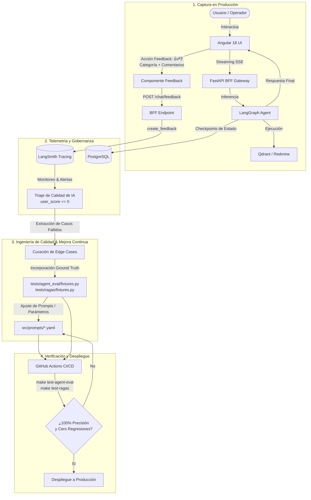

# Arquitectura de Gobernanza de IA, Aceptación de Feedback y Mejora Continua (The AI Flywheel)

**Fecha:** 2026-09-28  
**Módulo:** Gobernanza, Telemetría y Calidad Continua (`ui/`, `bff/`, `src/agent/`, `tests/agent_eval/`)  
**Estado:** Activo / Especificación de Producción  

---

## 1. Visión General: De un Agente Aislado a un Sistema Gobernado

En despliegues de Inteligencia Artificial para entornos corporativos e infraestructura crítica (ITSM, SRE, DevOps), la capacidad de generar respuestas o ejecutar comandos es solo la mitad del desafío. El verdadero reto radica en garantizar la **gobernanza operativa**, la **auditabilidad total** y un **bucle cerrado de retroalimentación (Feedback Flywheel)** que permita la mejora continua sin introducir regresiones.

Este proyecto implementa una arquitectura integral de gobernanza que articula:
1. **Supervisión y Control Humano (Human-In-The-Loop):** Aprobación explícita previa a mutaciones con impacto real en bases de datos externas (Redmine).
2. **Telemetría y Linaje Inmutable:** Registro de cada interacción, prompt, token consumido, tiempo de latencia y estado intermedio en PostgreSQL y LangSmith.
3. **Captura Multimodal de Feedback:** Mecanismos de retroalimentación explícita (calificación y categorización por el usuario final) e implícita (ajuste de proyectos por operadores).
4. **Ciclo Cerrado de Mejora (Continuous Improvement Flywheel):** Transformación sistemática de fallos o inconformidades en casos de prueba reproducibles dentro de la suite de evaluación determinística.

---

## 2. Topología del Bucle de Mejora Continua (The AI Flywheel)

El siguiente diagrama ilustra cómo fluye la retroalimentación desde la capa de presentación hasta los pipelines de pruebas automatizadas en CI/CD:



---

## 3. Taxonomía de la Retroalimentación (Feedback Loops)

El sistema captura dos categorías complementarias de feedback:

### 3.1. Feedback Explícito (End-User Rating)
Implementado en el frontend de Angular ([`message-bubble.component.html`](../ui/src/app/features/chat/components/message-bubble/message-bubble.component.html)) y procesado por el BFF ([`bff/app/chat/router.py`](../bff/app/chat/router.py)):

* **Canal Cuantitativo:** Botones de pulgar arriba (score = 1.0) y pulgar abajo (score = 0.0) vinculados al `run_id` específico de la ejecución del grafo.
* **Canal Cualitativo (Categorización y Diagnóstico):** Al marcar pulgar abajo, la interfaz despliega un formulario interactivo que solicita:
  * **Categoría del Problema:**
    * *Respuesta Inexacta / Alucinación* (problema de grounding en RAG).
    * *Contexto Insuficiente* (falla en la etapa de retrieval o chunking).
    * *Enrutamiento Erróneo* (clasificación de intención fallida).
    * *Tono / Formato Inadecuado* (falla de prompt engineering o guardrail de salida).
  * **Comentario Textual:** Explicación opcional del usuario sobre lo que esperaba.
* **Persistencia Inmediata en LangSmith:** El BFF consume el SDK oficial (`langsmith.Client().create_feedback()`) persistiendo la metadata de telemetría de forma no bloqueante.

### 3.2. Feedback Implícito y Supervisión Operativa (Human-in-the-Loop)
Implementado en el nodo [`confirm_issue_creation_node`](../src/agent/graph.py) de LangGraph mediante la directiva `interrupt()`:

* **Mecanismo:** Cuando el agente clasifica un nuevo bug y recomienda crear un ticket, interrumpe el grafo y sugiere un proyecto destino (ej. `infraestructura-de-servicios` o `proyecto-prueba`).
* **Señal de Calidad:**
  * Si el operador aprueba directamente la sugerencia, se valida la exactitud del razonamiento del modelo.
  * Si el operador sobrescribe manualmente el proyecto asignado o cancela la creación, se genera una señal implícita de corrección que queda registrada en el historial inmutable del `State` de LangGraph persistido en PostgreSQL.

---

## 4. Auditoría, Trazabilidad y Cumplimiento Normativo (Compliance)

Para satisfacer estándares de seguridad empresarial y auditoría (SOC2, ISO 27001, marcos de gobernanza de IA responsable):

1. **Inmutabilidad del Estado (`AgentState`):** Cada transición de nodos en LangGraph es registrada por el checkpointer de PostgreSQL (`langgraph-checkpoint-postgres`). Se conserva el historial exacto de:
   * Mensajes originales del usuario.
   * Razonamiento estructurado del modelo (`reasoning` en Pydantic).
   * Contexto recuperado de la base de conocimiento (`rag_context`).
   * Tickets de Redmine creados o consultados (`retrieved_issue_ids`, `created_issue_id`).
2. **Defensa en Profundidad (CQS y Guardrails):**
   * **Guardrail de Entrada (`analyze_safe_query`):** Filtra intentos de inyección de prompt o solicitudes fuera de dominio antes de alcanzar el grafo principal.
   * **Principio de Mínimo Privilegio (CQS):** Durante la deduplicación y el RAG, el agente opera en entorno de solo lectura sin capacidad de ejecutar mutaciones.
   * **Guardrail de Salida (`output_guardrail`):** Valida que la síntesis final mantenga confidencialidad y no exponga credenciales ni información sensible.

---

## 5. El Protocolo de Mejora Continua: De la Alerta al Test

El proceso operativo para evolucionar el sistema ante incidencias reales sigue cuatro etapas estrictas:

```
[ Feedback Negativo en LangSmith ]
              │
              ▼
[ 1. Triaje Técnico ] ──> ¿Es fallo de Retrieval (RAG) o de Lógica de Agente?
              │
              ├─ Si es RAG: Evaluar score de Faithfulness o Context Precision en Ragas.
              └─ Si es Agente: Evaluar árbol de decisión en LangGraph.
              │
              ▼
[ 2. Creación del Caso de Test ] ──> Agregar a tests/agent_eval/fixtures.py
              │                      (con expected_route, expected_is_sufficient, etc.)
              ▼
[ 3. Refinamiento ] ──> Modificar prompts YAML (src/prompts/) o ajustar lógica de nodos.
              │
              ▼
[ 4. Validación en CI/CD ] ──> `make test-agent-eval` y `make test-ragas`
                                (Garantiza 100% en benchmarks sin regresiones)
```

### Ejemplo Concreto:
Si un usuario reporta un falso positivo en deduplicación (un bug nuevo clasificado erróneamente como ticket existente), el caso se añade de inmediato a `DEDUPLICATION_TEST_CASES` en [`tests/agent_eval/fixtures.py`](../tests/agent_eval/fixtures.py) como control negativo. El prompt [`src/prompts/triage_duplicate_check.yaml`](../src/prompts/triage_duplicate_check.yaml) se afina, y el nuevo comportamiento queda blindado para siempre por la suite de integración continua.

---

## 6. Conclusión y Valor para el Negocio

Este enfoque transforma la solución de un "prototipo estático" a una **plataforma viva y auditable**:
* **Riesgo Operacional Controlado:** Las decisiones críticas pasan por supervisión humana antes de mutar sistemas de registro.
* **Reducción Sistemática del Error:** Cada inconformidad de usuario se capitaliza como un activo de prueba determinístico.
* **Transparencia Total:** Cumplimiento total de requisitos de explicabilidad y auditoría de decisiones automáticas.
