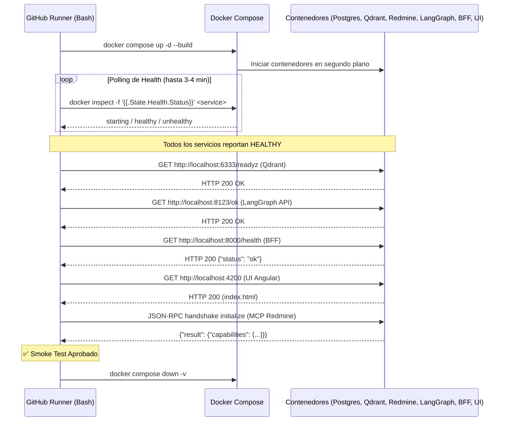

# Guía Integral de DevOps, CI/CD y Estrategia de Testing con GitHub Actions

Esta guía explica en detalle cómo funciona la Integración Continua (CI), qué tipos de pruebas existen y por qué son necesarias, cómo se verifica el levantamiento de servicios multi-contenedor y la anatomía técnica de los archivos `.yml` de GitHub Actions aplicada al proyecto **Redmine + LangGraph + LlamaIndex RAG**.

---

## 1. Fundamentos de CI/CD y DevOps

### ¿Qué es CI/CD?
* **CI (Continuous Integration / Integración Continua):** Es la práctica de automatizar la integración de cambios de código de múltiples colaboradores en un repositorio compartido. En cada `push` o `pull request`, un servidor automatizado descarga el código, lo compila, ejecuta linters y corre pruebas automáticas. El objetivo principal es detectar errores de integración tempranamente (*"Fail-Fast"*).
* **CD (Continuous Delivery / Continuous Deployment):**
  * **Continuous Delivery:** El código validado por CI está automáticamente preparado y empaquetado (ej. imágenes Docker) para desplegarse a producción con un solo clic.
  * **Continuous Deployment:** Cada cambio que supera todas las pruebas del pipeline se despliega a producción automáticamente sin intervención humana.

```
                     ┌─────────────────── CI ───────────────────┐  ┌───────────── CD ─────────────┐
                     │                                          │  │                             │
[Código / Commit] ──> [Linters & Tipado] ──> [Tests Unitarios] ──> [Docker Smoke Tests] ──> [Deploy Staging/Prod]
```

### Principio "Fail-Fast" (Fallar Rápido y Barato)
El costo de corregir un error aumenta exponencialmente a medida que avanza en el ciclo de vida del software. Por ello, el pipeline se diseña en etapas donde las tareas más rápidas y baratas se ejecutan primero:
1. **Segundos:** Linters y análisis de tipos (Ruff, MyPy). Si falla una coma o un tipo de dato, el pipeline se detiene inmediatamente sin gastar recursos.
2. **Menos de 1 minuto:** Tests unitarios y compilación básica.
3. **2-3 minutos:** Construcción de imágenes Docker y pruebas de integración/levantamiento de servicios.

---

## 2. ¿Cómo funciona GitHub Actions?

GitHub Actions es una plataforma de automatización de flujos de trabajo (workflows) integrada directamente en GitHub.

### Componentes Clave
1. **Workflow (Flujo de trabajo):** Proceso automatizado configurable definido en un archivo `.yml` dentro de la carpeta `.github/workflows/`.
2. **Eventos (Triggers):** Sucesos que disparan la ejecución del workflow (ej. `push` a una rama, creación de un `pull_request`, un horario programado `schedule` o disparo manual `workflow_dispatch`).
3. **Jobs (Trabajos):** Conjunto de pasos que se ejecutan dentro del mismo entorno. Por defecto, **los jobs se ejecutan en paralelo**, salvo que se configure dependencias explícitas (`needs: [job_a]`).
4. **Steps (Pasos):** Tareas secuenciales individuales dentro de un job (ejecutar un comando shell o invocar una Action).
5. **Actions (Acciones):** Bloques de código reutilizables del Marketplace de GitHub (ej. `actions/checkout@v4`, `actions/setup-python@v5`).
6. **Runners (Ejecutores):** Servidores donde se ejecutan los jobs.

### ¿Qué es un Runner y dónde corre el código?
Un **Runner** es una máquina virtual (o contenedor) efímera y aislada proporcionada por GitHub (en la nube de Azure) o autohospedada (Self-Hosted):
* Cuando seleccionamos `runs-on: ubuntu-latest`, GitHub aprovisiona una VM limpia con Linux Ubuntu (2 cores CPU, 7 GB RAM, ~14 GB SSD).
* Esta VM viene equipada de fábrica con herramientas populares: **Docker Engine, Docker Compose, Git, Python, Node.js, Curl, Wget, etc.**
* **Entorno Efímero:** Al finalizar el workflow, la máquina virtual se destruye por completo. Ningún estado, archivo o contenedor sobrevive a la siguiente ejecución a menos que se guarde explícitamente en caché o como artefacto.

---

## 3. Tipos de Tests: ¿Cuáles son necesarios y por qué?

En un sistema moderno compuesto por Agentes (LangGraph), Bases Vectoriales (Qdrant), APIs REST (Redmine, FastAPI) y Frontend (Angular), se aplica una pirámide de pruebas adaptada:

```
                      / \
                     / R \        Evaluación RAG / LLM (Ragas, benchmarks)
                    /-----\       [Lento, costoso, no-determinista]
                   / Smoke \      Smoke Tests / Healthchecks de Servicios
                  /---------\     [Levantamiento Docker, puertos, /health]
                 / Integrac. \    Tests de Integración
                /-------------\   [Cliente Redmine <-> API, RAGEngine <-> Qdrant]
               /   Unitarios   \  Tests Unitarios & Compilación
              /-----------------\ [Schemas Pydantic, Routers FastAPI, Graph]
             / Linter & Typecheck\ Análisis Estático (Ruff, MyPy, TypeScript)
            /---------------------\ [Inmediato, determinista, costo $0]
```

### 1. Análisis Estático y Linting (Ruff, MyPy, ESLint)
* **¿Qué hace?** Lee el código fuente sin ejecutarlo para buscar errores de sintaxis, violaciones de estándares PEP8, imports no utilizados y discrepancias de tipado estático.
* **¿Por qué es necesario?** Atrapa entre el 20% y 30% de los errores comunes (errores tipográficos, argumentos faltantes en funciones) en menos de 10 segundos.

### 2. Tests Unitarios (Unit Tests)
* **¿Qué hace?** Evalúa funciones o clases aisladas del resto del sistema, usando dobles de prueba (mocks o stubs) para evitar conexiones a bases de datos o red.
* **Ejemplos en este proyecto:**
  * Validar que el parser de tickets ([src/redmine/parser.py](file:///home/santi/Documentos/LlamaIndex-RAG-Project/src/redmine/parser.py)) transforma correctamente un JSON de Redmine a documentos de LlamaIndex.
  * Validar que los modelos Pydantic (`SafeQueryClassification`, `IntentClassification`) aceptan y rechazan los payloads correctos.
  * Verificar que el grafo de LangGraph ([build_graph()](file:///home/santi/Documentos/LlamaIndex-RAG-Project/src/agent/graph.py#L397)) compila sin ciclos inválidos ni nodos desconectados.
* **¿Por qué es necesario?** Son deterministas, instantáneos y dicen con precisión exacta qué línea de código falló.

### 3. Tests de Integración
* **¿Qué hace?** Evalúa la interacción real entre dos o más componentes acoplados.
* **Ejemplos en este proyecto:**
  * Probar que [RAGEngine](file:///home/santi/Documentos/LlamaIndex-RAG-Project/src/rag/engine.py) crea una colección en una instancia viva de Qdrant y recupera nodos jerárquicos ([test_rag_engine_real.py](file:///home/santi/Documentos/LlamaIndex-RAG-Project/tests/integration/test_rag_engine_real.py)).
  * Probar que el MCP Server de Redmine responde a llamadas JSON-RPC válidas.
* **¿Por qué es necesario?** Los tests unitarios no garantizan que dos sistemas entiendan el mismo formato de datos en un entorno real.

### 4. Smoke Tests / Sanity Checks (Pruebas de Humo)
* **¿Qué hace?** Es una prueba rápida y superficial pero crucial: *"Si encendemos la máquina, ¿sale humo o funciona?"*. No prueba toda la lógica de negocio, sino que los componentes esenciales levanten, respondan en sus puertos asignados y no colapsen al arrancar.
* **¿Por qué es necesario?** Evita desplegar código con errores de variables de entorno faltantes, Dockerfiles rotos, puertos colisionados o dependencias no instaladas.

### 5. Evaluación RAG y LLM (Ragas / Benchmarks)
* **¿Qué hace?** Evalúa métricas semánticas (Faithfulness, Answer Relevancy, Context Precision) usando LLMs como jueces.
* **¿Por qué NO deben correr en la CI básica?**
  * Son **no-deterministas** (la respuesta de un LLM puede variar ligeramente).
  * Son **lentas** (pueden tomar 10 a 25 minutos).
  * Consumen **tokens de pago** (Groq, OpenAI, NVIDIA).
  * **Buena práctica:** Se ejecutan en un workflow independiente (disparo manual o cron nocturno).

---

## 4. ¿Cómo y Dónde se Testea que un Servicio Levante Correctamente?

### ¿Dónde levantan los servicios en GitHub Actions?
Cuando el runner de GitHub Actions ejecuta `docker compose up -d`:
1. El Docker daemon dentro de la VM `ubuntu-latest` descarga las imágenes base (`postgres:16`, `qdrant/qdrant`, `redmine:5.1`) y construye las imágenes personalizadas (`bff`, `ui`, `langgraph-api`, `mcp-server`).
2. Se crea una red virtual Docker interna (`langgraph_net`) y los puertos se mapean al `localhost` del runner (ej. `localhost:8000`, `localhost:8123`, `localhost:3000`).
3. Todos los contenedores corren en segundo plano dentro de esa misma máquina virtual.

### ¿Cómo se comprueba que están vivos y listos?

Hay una diferencia fundamental en DevOps entre **Liveness (el proceso inició)** y **Readiness (el servicio está listo para recibir tráfico)**:

#### Caso Práctico en este proyecto: Redmine y Postgres
* Cuando el contenedor de PostgreSQL arranca, tarda ~2 segundos en inicializar el motor de datos. Un check simple de proceso diría que "está vivo", pero si Redmine intenta conectarse antes de que acepte conexiones TCP, fallará.
  * *Solución:* Usar `healthcheck` con `pg_isready -U redmine -d redmine`.
* Redmine (Ruby on Rails) arranca el contenedor, pero antes de responder en HTTP debe ejecutar migraciones en la base de datos de PostgreSQL. Durante 30 segundos, cualquier petición HTTP dará error o timeout.
  * *Solución:* Usar `start_period: 60s` y esperar a que el healthcheck (`wget --spider http://localhost:3000`) sea `healthy`.

#### Estrategia de Verificación de Smoke Tests en CI



---

## 5. Anatomía y Arquitectura de los Archivos YAML (`.github/workflows/*.yml`)

Un archivo YAML en GitHub Actions sigue una estructura jerárquica estandarizada:

```yaml
# 1. NOMBRE DEL WORKFLOW
name: Pipeline de Integración Continua

# 2. DISPARADORES (Triggers / Eventos)
on:
  push:
    branches: [ main, develop ]   # Corre al hacer push en estas ramas
  pull_request:
    branches: [ main, develop ]   # Corre al abrir o actualizar un PR
  workflow_dispatch:              # Permite ejecutarlo manualmente desde la web de GitHub

# 3. CONTROL DE CONCURRENCIA (Cancela ejecuciones previas redundantes)
concurrency:
  group: ${{ github.workflow }}-${{ github.ref }}
  cancel-in-progress: true

# 4. VARIABLES DE ENTORNO GLOBALES
env:
  PYTHON_VERSION: "3.12"
  NODE_VERSION: "20"

# 5. JOBS (Tareas independientes o interconectadas)
jobs:
  # ── JOB 1: Rápido (Fail-Fast) ──
  analisis-estatico:
    name: Lint & Typecheck
    runs-on: ubuntu-latest
    steps:
      - name: Descargar código del repositorio
        uses: actions/checkout@v4

      - name: Configurar Python
        uses: actions/setup-python@v5
        with:
          python-version: ${{ env.PYTHON_VERSION }}
          cache: "pip"  # Acelera la instalación usando caché

      - name: Instalar herramientas de calidad
        run: pip install ruff mypy

      - name: Ejecutar Ruff Linter
        run: ruff check .

  # ── JOB 2: Dependiente del Job 1 ──
  smoke-tests-servicios:
    name: Build & Smoke Test de Servicios
    runs-on: ubuntu-latest
    needs: [analisis-estatico]  # NO se ejecuta si 'analisis-estatico' falla
    steps:
      - name: Descargar código
        uses: actions/checkout@v4

      - name: Configurar Docker Buildx (Caché de imágenes)
        uses: docker/setup-buildx-action@v3

      - name: Crear variables de entorno simuladas para CI
        run: |
          cat << 'EOF' > .env
          REDMINE_DB_NAME=redmine
          REDMINE_DB_USER=redmine
          REDMINE_DB_PASSWORD=redmine_secret
          REDMINE_SECRET_KEY_BASE=ci_secret_12345
          REDMINE_API_KEY=ci_key_12345
          GROQ_API_KEY=dummy_groq_key
          NVIDIA_API_KEY=dummy_nvidia_key
          HUGGINGFACE_API_KEY=dummy_hf_key
          EOF
          cp .env bff/.env

      - name: Levantar todos los servicios
        run: docker compose up -d --build

      - name: Esperar Healthchecks
        timeout-minutes: 4
        run: |
          # Bucle de sondeo hasta que los contenedores estén healthy
          SERVICES=("redmine_postgres" "qdrant_vectordb" "redmine_app" "langgraph_api_server" "bff_server")
          for svc in "${SERVICES[@]}"; do
            until [ "$(docker inspect -f '{{.State.Health.Status}}' $svc 2>/dev/null)" == "healthy" ]; do
              sleep 5
            done
            echo "✅ $svc está HEALTHY"
          done

      - name: Ejecutar Smoke Tests HTTP
        run: |
          curl -f http://localhost:8000/health
          curl -f http://localhost:8123/ok
          curl -f http://localhost:6333/readyz || curl -f http://localhost:6333/collections
          curl -f -I http://localhost:3000
          curl -f -I http://localhost:4200

      - name: Volcado de logs si ocurre un error
        if: failure()  # Solo se ejecuta si algún step anterior falló
        run: docker compose logs --tail=100

      - name: Apagar contenedores y limpiar volúmenes
        if: always()   # Se ejecuta SIEMPRE (éxito o fallo)
        run: docker compose down -v
```

---

## 6. Glosario de Conceptos DevOps Clave

| Concepto | Definición y Rol en el Proyecto |
| :--- | :--- |
| **Pipeline** | Secuencia automatizada de pasos que toma el código desde el commit hasta su verificación/despliegue. |
| **DAG (Directed Acyclic Graph)** | Estructura en la que los jobs de CI se organizan mediante relaciones `needs`, permitiendo ejecuciones paralelas y dependencias sin ciclos. |
| **Idempotencia** | Propiedad por la cual una acción produce el mismo resultado sin importar cuántas veces se ejecute (ej. scripts de inicialización o migraciones). |
| **Healthcheck** | Mecanismo periódico donde Docker ejecuta un comando dentro del contenedor (`pg_isready`, `curl`, `wget`) para evaluar si el servicio responde adecuadamente. |
| **Secrets Management** | Almacenamiento seguro y cifrado de claves privadas (`${{ secrets.TOKEN }}`) en GitHub, evitando exponer credenciales en texto plano en el repositorio. |
| **Artifacts** | Archivos generados durante el workflow (ej. logs de error, reportes HTML de cobertura o dashboards) que se conservan para descarga posterior. |
| **Docker Layer Caching** | Reutilización de capas intermedias inalteradas de imágenes Docker para no reinstalar paquetes del sistema en cada ejecución de CI. |

---

## 7. Resumen de Recomendaciones para este Repositorio

1. **Separar en 2 Workflows:**
   * `ci.yml` (Gatillado en cada Push/PR): Linters, compilación de UI, compilación del grafo y levantamiento/smoke tests de servicios (~2.5 min).
   * `rag-eval.yml` (Gatillado manualmente o semanalmente): Evaluación Ragas de precisión y retrieval usando LLMs reales.
2. **Uso de `.env.ci` / Variables Dummy:**
   * Para los smoke tests de levantamiento, no se requiere pagar APIs de Groq o NVIDIA. Un conjunto de claves dummy permite validar imports, compilación de esquemas Pydantic y arranque de servidores sin llamadas remotas costosas.
3. **Limpieza con `if: always()`:**
   * Siempre incluir `docker compose down -v` al final del job para asegurar que el runner libere recursos adecuadamente.
